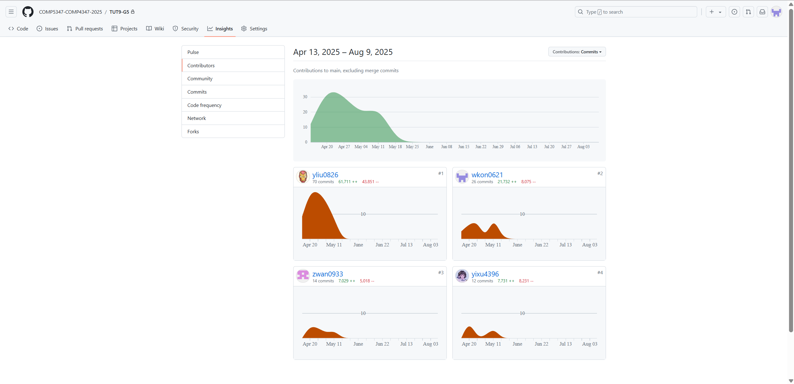
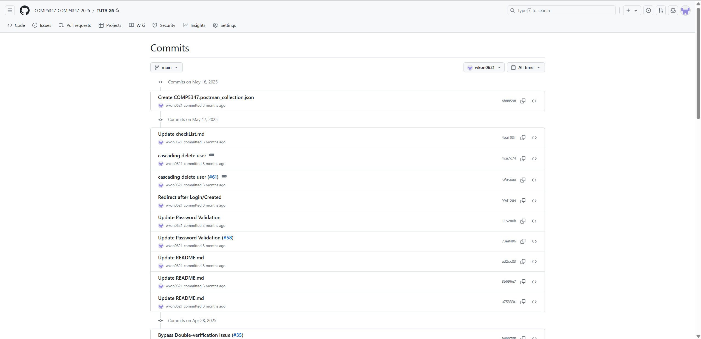
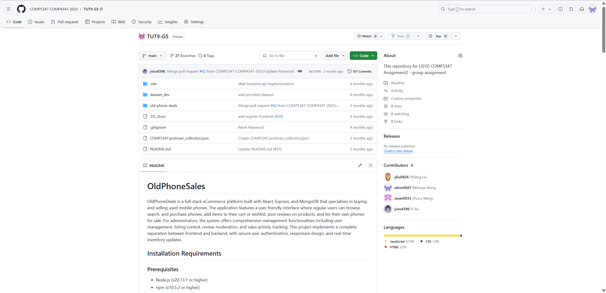

# E-commerce Platform for Used Phones (TUT9-G5)

A full-stack e-commerce platform for selling used phones, built with the MERN stack.

## 📖 Project Goal & Motivation

This project aimed to deliver a complete, functional full-stack e-commerce platform specifically designed for selling used phones. The motivation was to gain practical experience in building modern web applications using a popular technology stack and implementing core e-commerce functionalities.

## 🏗️ Architecture & Technical Highlights

*   **MERN Stack Application**: Developed using the **MERN stack** (**MongoDB**, **Express.js**, **React**, **Node.js**), providing a robust and scalable foundation for web development.
*   **RESTful API Backend**: Features a powerful **Node.js** and **Express.js** backend that exposes a **RESTful API** for all data operations, ensuring clear separation of concerns and efficient data exchange.
*   **Dynamic React Frontend**: A dynamic and interactive user interface built with **React**, offering a smooth and responsive user experience.
*   **User Authentication**: Implemented a secure user authentication system using **JWT (JSON Web Tokens)** for managing user sessions and access control.
*   **API Documentation**: API endpoints are clearly documented using **Swagger**, facilitating easy integration and understanding for other developers.

## 👥 Team & My Contributions

This project was a collaborative effort by the following team members:
*   @yliu0826
*   @wkon0621
*   @zwan0933
*   @yixu4396

As a key developer, I was responsible for implementing core backend features, including the user authentication system with JWT, designing and building product-related RESTful APIs, and documenting the API endpoints with Swagger.

## 🛠️ Tech Stack


## 🏆 Proof of Contribution

The following screenshots are provided as evidence of my work on the original private repository.

### A. Contributor Statistics
*(This image shows the contribution graph from the private repository, highlighting team activity.)*



### B. Personal Commit History
*(A snapshot of my personal commit log, demonstrating my development process and specific contributions.)*



### C. Project Team Homepage
*(The project's main page on the private university GitHub, showing all team members.)*



## 🚀 Installation & Usage

Follow these steps to set up and run the project:

### 1. Clone the Repository

```bash
git clone https://github.com/YOUR_USERNAME/sydney-tut9-g5-oldphonesales-showcase.git
cd sydney-tut9-g5-oldphonesales-showcase # Navigate to the project directory
```

### 2. Install Dependencies

Navigate to both the client (frontend) and server (backend) directories and install their respective dependencies.

```bash
# For the backend
cd old-phone-deals/server
npm install

# For the frontend
cd ../client
npm install
```

### 3. Configure Environment Variables

Create a `.env` file in the appropriate directories (e.g., `server/.env`) and add necessary environment variables (e.g., MongoDB URI, JWT secret).

### 4. Run the Application

Start both the backend and frontend servers.

```bash
# Start the backend server
cd old-phone-deals/server
npm start

# Start the frontend development server
cd ../client
npm start
```

## 📄 License

This project is licensed under the MIT License.

---

**MIT License**

Copyright (c) 2024 Weixuan Kong

Permission is hereby granted, free of charge, to any person obtaining a copy
of this software and associated documentation files (the "Software"), to deal
in the Software without restriction, including without limitation the rights
to use, copy, modify, merge, publish, distribute, sublicense, and/or sell
copies of the Software, and to permit persons to whom the Software is
furnished to do so, subject to the following conditions:

The above copyright notice and this permission notice shall be included in all
copies or substantial portions of the Software.

THE SOFTWARE IS PROVIDED "AS IS", WITHOUT WARRANTY OF ANY KIND, EXPRESS OR
IMPLIED, INCLUDING BUT NOT LIMITED TO THE WARRANTIES OF MERCHANTABILITY,
FITNESS FOR A PARTICULAR PURPOSE AND NONINFRINGEMENT. IN NO EVENT SHALL THE
AUTHORS OR COPYRIGHT HOLDERS BE LIABLE FOR ANY CLAIM, DAMAGES OR OTHER
LIABILITY, WHETHER IN AN ACTION OF CONTRACT, TORT OR OTHERWISE, ARISING FROM,
OUT OF OR IN CONNECTION WITH THE SOFTWARE OR THE USE OR OTHER DEALINGS IN THE
SOFTWARE.