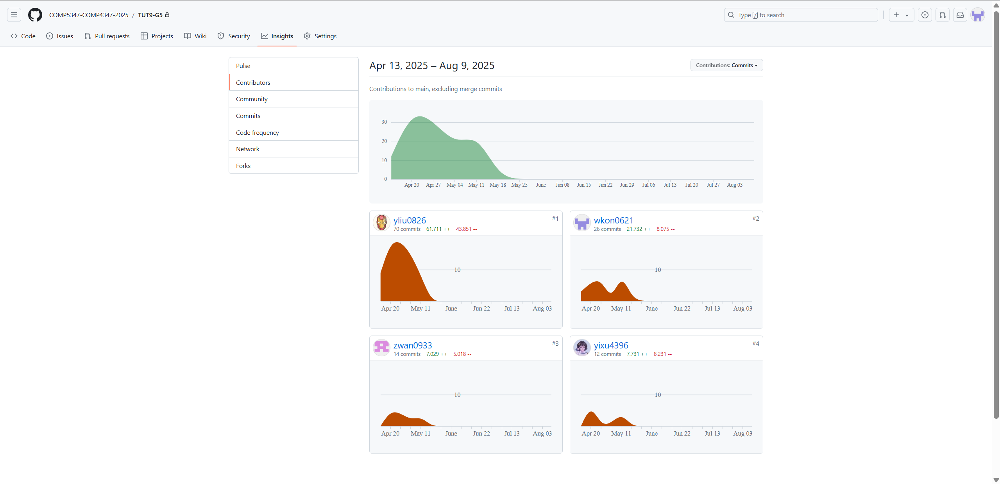
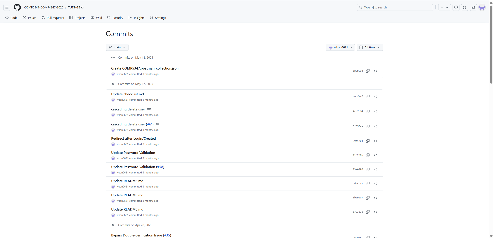
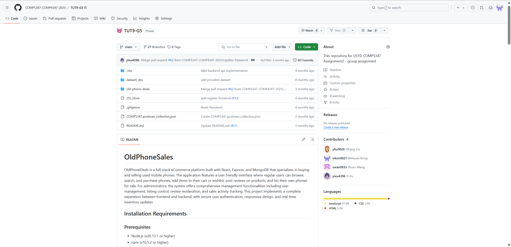

# E-commerce Platform for Used Phones (TUT9-G5)

A team course project for selling used phones, built with MongoDB, Express, React, and Node.js. AI-assisted maintenance currently focuses on the repository documentation; the application has not been rerun for this update.

## 📖 Project Goal & Motivation

This project implements used-phone listings, user accounts, shopping-cart and order flows, and administration pages. It was developed to practice full-stack web application development.

## 🏗️ Architecture & Technical Highlights

*   **MERN Stack Application**: MongoDB/Mongoose data storage, an Express backend, and a React frontend built with Vite.
*   **RESTful API Backend**: Includes routes for accounts, phone listings, carts, orders, and administration.
*   **React Frontend**: Includes browsing, profile, cart, and administration pages.
*   **User Authentication**: Includes session-based access checks and JWT email-verification tokens.
*   **API Documentation**: Includes Swagger configuration and a Postman collection.

## 👥 Team & Contributions

This project was a collaborative effort by the following team members:
*   @yliu0826
*   @wkon0621
*   @zwan0933
*   @yixu4396

The source includes account and listing APIs, authentication flows, and Swagger configuration. Historical contribution screenshots are retained below.

## 🛠️ Tech Stack


## 🏆 Proof of Contribution

The following screenshots are provided as evidence of my work on the original private repository.

### A. Contributor Statistics
*(This image shows the contribution graph from the private repository, highlighting team activity.)*



### B. Personal Commit History
*(A snapshot of my personal commit log, demonstrating my development process and specific contributions.)*



### C. Project Team Homepage
*(The project's main page on the private university GitHub, showing all team members.)*



## 🚀 Installation & Usage

Follow these steps to set up and run the project:

### 1. Clone the Repository

```bash
git clone https://github.com/Jackela/sydney-tut9-g5-oldphonesales-showcase.git
cd sydney-tut9-g5-oldphonesales-showcase # Navigate to the project directory
```

### 2. Install Dependencies

From the repository root, install the backend and frontend dependencies:

```bash
npm --prefix old-phone-deals/server install
npm --prefix old-phone-deals/client install
```

### 3. Configure the Backend

Create `old-phone-deals/server/.env` with `MONGODB_URI`, `SESSION_SECRET`, and `JWT_SECRET`. MongoDB must be available before the backend can start. Email verification and password reset also require the mail settings read by `old-phone-deals/server/service/emailService.js`, including `FRONTEND_URL`.

The backend defaults to port `7777`; the frontend API client uses `http://localhost:7777/api`. The backend CORS configuration expects the frontend at `http://localhost:5173`.

### 4. Run the Application

Run each command in a separate terminal, from the repository root. The working directory matters because the backend loads `.env` from its current directory.

```bash
# Backend: package.json start script runs node server.js
cd old-phone-deals/server
npm start
```

```bash
# Frontend: package.json start script runs Vite
cd old-phone-deals/client
npm start
```

The frontend also defines `npm run build` and `npm run serve` for a build and local preview. These instructions were checked against the source and package scripts; MongoDB, email flows, and browser behavior were not exercised for this README update.

## 📄 License

This project is licensed under the MIT License.

---

**MIT License**

Copyright (c) 2024 Weixuan Kong

Permission is hereby granted, free of charge, to any person obtaining a copy
of this software and associated documentation files (the "Software"), to deal
in the Software without restriction, including without limitation the rights
to use, copy, modify, merge, publish, distribute, sublicense, and/or sell
copies of the Software, and to permit persons to whom the Software is
furnished to do so, subject to the following conditions:

The above copyright notice and this permission notice shall be included in all
copies or substantial portions of the Software.

THE SOFTWARE IS PROVIDED "AS IS", WITHOUT WARRANTY OF ANY KIND, EXPRESS OR
IMPLIED, INCLUDING BUT NOT LIMITED TO THE WARRANTIES OF MERCHANTABILITY,
FITNESS FOR A PARTICULAR PURPOSE AND NONINFRINGEMENT. IN NO EVENT SHALL THE
AUTHORS OR COPYRIGHT HOLDERS BE LIABLE FOR ANY CLAIM, DAMAGES OR OTHER
LIABILITY, WHETHER IN AN ACTION OF CONTRACT, TORT OR OTHERWISE, ARISING FROM,
OUT OF OR IN CONNECTION WITH THE SOFTWARE OR THE USE OR OTHER DEALINGS IN THE
SOFTWARE.